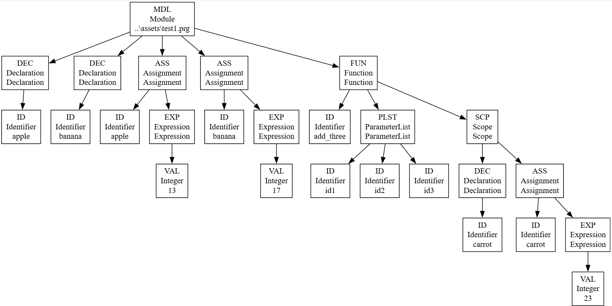

# LangJam2025


LangJam2025 is a modular C++ project for experimenting with language and VM design, rapid prototyping, and cross-platform SDL2 graphics.



Currently has a VM and a parser which generates an AST.


---

## Roadmap

### Next Steps

#### Stage 1

Basic Lang no Scope All Vars Global

- [+] AST
- [+] Parser
- [ ] Symbol Table
- [ ] Code Generator V0.1


#### Stage 2

Named Function Calls w+ parameters (Really more like subroutines)

- [ ] Function Syntax
- [ ] Subroutine Code Generator V0.2

#### Stage 3

Hierarchical Scope for Variable Visability

- [?] Nested Symbol Tables
- [ ] Scope Related Parser


## Later Improvements

### Possible Graphics Instructions

- [ ] ? `FB_PRESENT` / `FB_DIRTY` flag
- [ ] `DRAW_COLOR`
- [ ] `CLIP_X0/Y0/X1/Y1`
- [ ] `PSET` (x, y, color)
- [ ] `HLINE` / `VLINE`
- [ ] `FILL` (fast clear)


### VM / ISA improvements

- [ ] `MEMCPY`- family of primitives for faster framebuffer uploads/blits.
- [ ] Call/return mechanism: `CALL addr` / `RET` + a return stack (or reuse main stack with convention).
- [ ] Bitwise ops `AND`, `OR`, `XOR`, `SHL`, `SHR` (useful for pixel math).
- [ ] Instructions for setting up memory layout, screen, stack etc


### Tooling and structure

- [ ] Move VM public headers into `include/` (optional) and keep sources in `vm/`.
- [ ] Add unit tests for the VM (single-step semantics for a few ops).
- [ ] Load PNGs into memory for graphics atlas etc
- [ ] Add a small “ROM” file format or loader (optional):
- [ ] Store code cells and initial data cells.


### Performance notes

- [ ] Current SDL path copies entire frame buffer each frame.
- [ ] Perhaps point `SDL_UpdateTexture` at VM memory directly rather than copy?


---

## Structure


- `runtime/` — SDL2-based virtual machine demo
- `lang/` — Language front-end (tokenizer, parser, AST)
- `min/` — Minimal C++ hello world example
- `scripts/` — PowerShell build and helper scripts


---

## Prerequisites (Windows)
- Visual Studio Code 
- C++ compiler
- PowerShell (for scripts)
- CMake 
- vcpkg 

### Install vcpkg
```powershell
# Choose a location, e.g. C:\vcpkg
git clone https://github.com/microsoft/vcpkg C:\vcpkg
C:\vcpkg\bootstrap-vcpkg.bat

# Make it available to CMake presets
$env:VCPKG_ROOT = "C:\vcpkg"
```


## Building & Running

Use the provided PowerShell scripts for easy setup and building:

```powershell
./scripts/build_runtime_debug.ps1
# Output: build/runtime/Debug/runtime.exe
```

Or build the minimal hello world:

```powershell
cd min
cmake -B build -S .
cmake --build build --config Debug
./build/Debug/min_hello.exe
```

The correct SDL2 DLL is automatically copied to your output directory by the build scripts.


